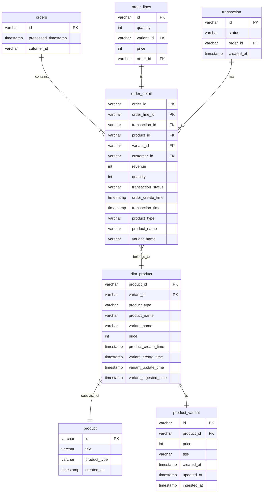
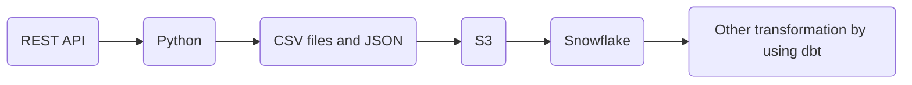
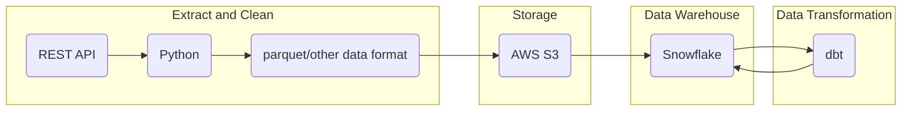

This is a case study to build a data warehouse for a client that uses Shopify as their commerce platform. 

# Repo Structure
    .
    ├── models                  # Models 
        ├── dim                 # Contains dimensional table
        ├── mart                # Contains mart/fact table
    ├── seeds                   # Raw CSV files 
    ├── tests                   # To put test here (for future work)
    ├── dbt_project.yml         # Contains the dbt config
    └── README.md

# Database
The data are in csv files (under `/seeds` folder). 
The data have been loaded to Snowflake (db name: `sl_shopify`)
| Schema | Description | 
| --- | --- |
| shopify_dim | Contains dimensional tables, including raw tables provided previously as csv files | 
| shopify_mart | Contains a table to be used for analytics and reporting purposes | 

# Section 1: Data Modelling and ELT
## 1. Entity Relationship Diagram
This is the STAR schema proposed to store the data:
| Table Name | Type | Schema | Directory |
| --- | ---| --- | ---|
| `orders` | dim | shopify_dim | `/seeds` |
| `order_lines` | dim | shopify_dim | `/seeds` |
| `transaction` | dim | shopify_dim | `/seeds` |
| `product` | dim | shopify_dim | `/seeds` |
| `product_variant` | dim | shopify_dim | `/seeds` |
| `dim_product` | dim | shopify_dim | `/models/dim` |
| `order_detail` | fact | shopify_mart | `/models/mart` |


## 2. Data Transfromation
1. Assuming that the data retrieved from REST API are automatically loaded, we can utilize Python to transform and clean the data and save it into a CSV file. 
2. Next, we can load both the CSV and JSON data into S3. The next step will be to create staging/dim tables based on the CSV files (this process can be done in Snowflake by using Snowpipe). 
3. These dim tables will then be ready to be utilized by data models for analysis and reporting purposes. One may consider to create intermediate tables/dbt ephemeral tables if the calculation is too complicated. 




## 3. Data Marts and Reports
In order to get information regarding "Revenue, Item Sales, Variant Price Changes, By Product, By Customer, By Date, if payment has been made and the time it occurred", the first step is to create a table called `order_detail`. This is a fact table with a structure depicted in the Entity Relationship Diagram above. You can find the SQL logic to build this table under `/models/mart/order_detail.sql`.

This table contains the most detailed view of each order line as it incorporates information across different staging/dim tables. It'll be easy to form many metrics based on this table through filtering, aggregation, and other SQL operations. 

The details of the `order_detail` table is as follows:
| Column Name | Description | Possible Use Cases |
| --- | --- | --- |
| `order_id` | Order ID | To count how many orders have been made |
| `order_line_id` | Order Line ID, 1 order may have more than 1 order_line_id | To count how many items purchased under 1 order |
| `transaction_id` | Transaction ID corresponding to the latest transaction status per order_id | To identify the payment information corresponding to the order |
| `product_id` | Product ID | | 
| `variant_id` | The product's variant ID | |
| `customer_id` | The customer ID who purchased the product | To count how many customers have purchased / active buyer |
| `price` | The amount of the corresponding line item / variant | To analyze price changes |
| `quantity` | The quantity of the purchase | |
| `revenue` | Total amount generated from this transaction (price * quantity) | By aggregating this column, you may derive total revenue/sales |
| `transaction_status` | The status of the latest transaction made | To identify whether a payment has been made or not, filter by `transaction_status = 'success'` | 
| `order_create_time` | Order create time | You may use this to get the base date for your aggregation formula |
| `transaction_time` | Transaction create time| To identify when the payment occurred |
| `product_type` | The product's type | To get the type of the product |
| `product_name` | The actual name of the product | To identify many metrics related to product analysis |
| `variant_name` | The product's variant name | To get the detail of each product |

### 3.1. SQL query to identify items that have stopped selling
Firstly, we can identify the items that have paid/succesful transactions over the past 60 days (`past_60_days`) and 7 days (`past_7_days`). Then we can do a `LEFT ANTI JOIN` from `past_60_days` with `past_7_days`. This is to get those variant_id that do not have corresponding `variant_id` in `past_7_days`. These are the variants that have stopped selling. 

```SQL
WITH past_60_days AS (
    SELECT 
        variant_id,
        variant_name,
        product_name,
        COUNT(DISTINCT order_id) AS num_order
    FROM 
        order_detail
    WHERE 
        DATE(order_create_time) <= DATE(current_date())
        AND DATE(order_create_time) >= DATE(current_date() - interval '60' day)
        AND transaction_status = 'success'
    GROUP BY 
        1
    HAVING 
        COUNT(DISTINCT order_id) > 0 
),

past_7_days AS (
    SELECT 
        variant_id,
        variant_name,
        product_name,
        COUNT(DISTINCT order_id) AS num_order
    FROM 
        order_detail
    WHERE 
        DATE(order_create_time) <= DATE(current_date())
        AND DATE(order_create_time) >= DATE(current_date() - interval '7' day)
        AND transaction_status = 'success'
    GROUP BY 
        1
    HAVING 
        COUNT(DISTINCT order_id) > 0 
)

SELECT
    DATE(CURRENT_DATE()) as anchor_date,
    p1.variant_name,
    p1.product_name
FROM 
    past_60_days AS p1
LEFT ANTI JOIN 
    past_7_days AS p2 
ON 
    p1.variant_id = p2.variant_id
```

### 3.2. Identifying such SKUs without writing long SQL query
To help the BI manager to identify such SKUs without writing long SQL query, we can build a data model that is scheduled as required by the user. 

Table design for lightweight data ingestion to Tableau:
| Column Name | Description | 
| --- | --- |
| `anchor_date` | The date when the model is being scheduled |
| `variant_name` | The product's variant name of the SKUs that have stopped selling |
| `product_name` | The product name of the SKUs that have stopped selling |

# Section 2: Validation and Communication
To ensure data quality, we can create data quality rules on the table:
1. consistency check
    - run the new SQL query and load it to a test/dev schema. 
    - select the necessary columns from test/dev and production/prod tables. 
    - compare both tables (test and productios). In PySpark, we can use `SUBTRACT` to check the consistency of both tables and spot the differences. In SQL, we can use `EXCEPT`. 
    - Note that this check may be costly. So it's important to select the correct data dates for testing.
    - Example:
    ```SQL
    WITH prod_sub_dev AS (
    SELECT DISTINCT 
        order_number,
        order_line_sku,
        expected_days_to_deliver
    FROM 
        prod
    WHERE 
        date ...date_filter...
    EXCEPT 
    SELECT DISTINCT 
        order_number,
        order_line_sku,
        expected_days_to_deliver
    FROM 
        dev
    WHERE 
        date ...date_filter...
    )

    SELECT 
        COUNT(*) = 0
    FROM 
        prod_sub_dev
    ```
2. validity check
    - this is to check whether the change impacted the columns that are not supposed to be NULL, such as order_id. 
3. uniqueness check 
    - this is to ensure that the change didn't create any duplicates for unique keys. 
4. custom check 
    - to check distinct `fulfilment_allocated_3pl` to only be 'SBS' after the transition date. 
    - to count distinct `fulfilment_allocated_3pl` before the transition date, should be more than 1. 
    - Example:
    ```SQL
    SELECT 
        COUNT(DISTINCT fulfilment_allocated_3pl) > 1
    FROM 
        dev
    WHERE 
        date >= DATE('2024-06-01')
    ```
5. completeness
    - to ensure that the change does not lead to data loss. 
    - we can achieve this by comparing the count records between the dev and production tables. 

# Section 3: Data Ingestion

## Explanation
- With incremental data from REST API, we can extract and clean the data with Python. 
- We also need to add a column which indicates the ingestion timing. 
- The result can then be saved as parquet/ORC/Avro and stored in AWS S3. The choice of data file format shall be based on the business requirements and it's recommended to not choose csv to be more scalable and compatible with distributed computing systems. Parquet/ORC/Avro also offers better compression system, thus leading to less storage consumed in AWS S3. 
- If the business requires full data as snapshot, we need to ingest the data in incremental mode (append) instead of overwriting existing data in Snowflake. This means that we will need to do a full data dump. 
- For further analysis and reporting, we can use dbt to transform the data and store it in Snowflake. 
- The data ingestion workflow can be automated by using Airflow. 
- Logging needs to be put in place in every step of the ingestion process. The information from the log and the job can then be stored as metadata. 
- The metadata can help in monitoring job completion and providing points of optimization, such as which jobs take too much time and resources. 


## Cost
Tech stack that will incur costs:
1. REST API call (may not be a lot as it's incremental fetching)
2. AWS S3: storage. We can optimize the storage cost by doing auto data archival (put cold data to S3 Glacier) for data longer than 5 years. 
3. Snowflake: compute cost, depending on the usage. We can optimize the cost by ensuring that the tables are well-partitioned (e.g. by region, by order create date, etc.). 
4. Airflow. 


## Security Considerations
- We need to ensure that sensitive information, such as credit card number, are encrypted before loading it into AWS S3 or other third party platforms. 
- We can implement data governance practices, such as restricting senstive table or column access.

## Monitoring and Maintenance
- By using Airflow and implementing good logging as well as metadata practices, we can ensure that jobs are cleared timely. 
- If it's not cleared timely, we need to identify points of optimization through the metadata and observation. Optimization: query optimization, data structure optimization, etc. 
- We also need to implement alerts depending on our needs (Failure, Success, and SLA). Every tasks need a failure alert and every important tasks need an SLA alert.
- We also need to keep up to date with Shopify's API changes, such as if there are new fields and status changes. 

# Others
## Limitations
Under limited time and resource constraint, the models created under `/models` folder may not be optimized (run time, resources used, and table types). 

## Future work
Given the limitations, some improvements may be considered to be done in the future:
- Creating a proper incremental tables.
- Create unit tests and automated data quality check. 
- Set up CI/CD.

Thank you for reading this Github repo. Have a great day. 
___
Created by Diana Suwanto
